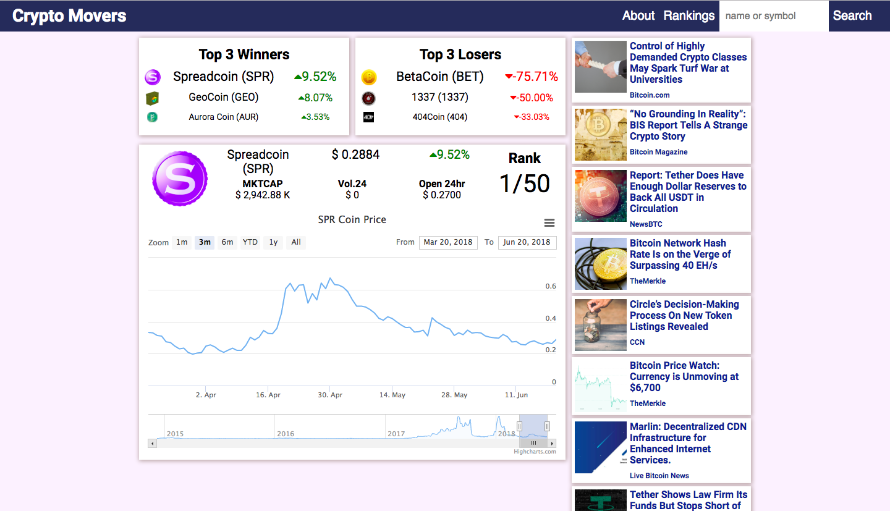
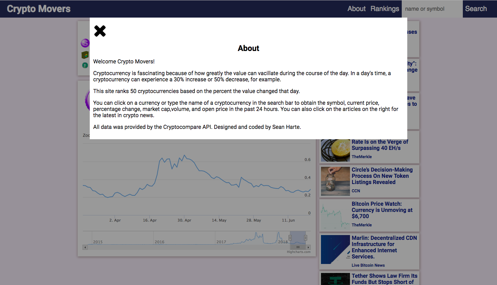

Crypto-Movers

This app ranks 50 cryptocurrencies by percentage change. The user can click on a currncy or type the name of a cyrptocurrency in the searhc bar to obtain the symbol, current price, percentage chaneg, market cap, volume, and open pice in the pas 24 hours.  The user can also click on the articles on the right on desktop screens or on the button of mobile screens for the latest in crypto news.

Screenshots

Main screen

About

Rankings

Full Currency info

Demo

<a href="https://hartecode.github.io/cryptowinners-losers/">Live Demo</a>

Technology

<ul>
	<li>HTML</li>
	<li>CSS</li>
	<li>Javscript</li>
	<li>Jquery</li>
	<li>Ajax</li>
	<li>Data visualization</li>
</ul>

Credits

<ul>
	<li><a href="https://www.highcharts.com/">Highcharts</a></li>
	<li><a href="https://www.cryptocompare.com/api/">Cryptocompare API</a></li>
</ul>

